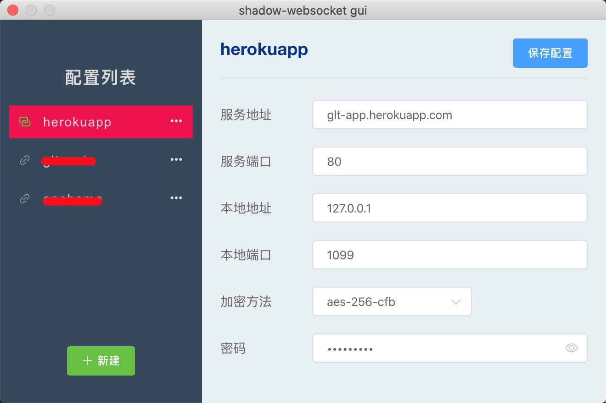
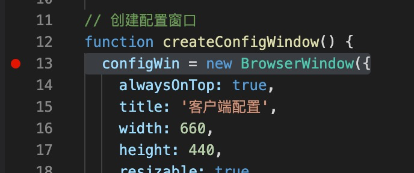
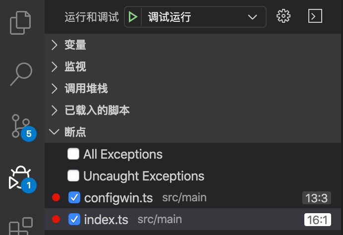

[](https://travis-ci.com/gaoletian/shadow-websocket-gui)

# shadow-websocket-gui for mac

> shadow-websocket gui for mac



#### todo list

- [x] shadow-websocket 可视化配置
- [ ] hosts 可视化编辑
- [ ] 快捷笔记
- [ ] 网址收藏
- [ ] 插件化子应用

#### 如何开始

```bash
# 安装依赖
yarn

# 开发
yarn dev

# 构建(只支持mac)
yarn build:darwin


```

#### 断点调试

`设置断点`



`调试运行`



---

This project was generated with [electron-vue](https://github.com/SimulatedGREG/electron-vue) using [vue-cli](https://github.com/vuejs/vue-cli). Documentation about the original structure can be found [here](https://simulatedgreg.gitbooks.io/electron-vue/content/index.html).
